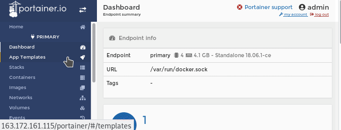
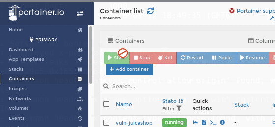
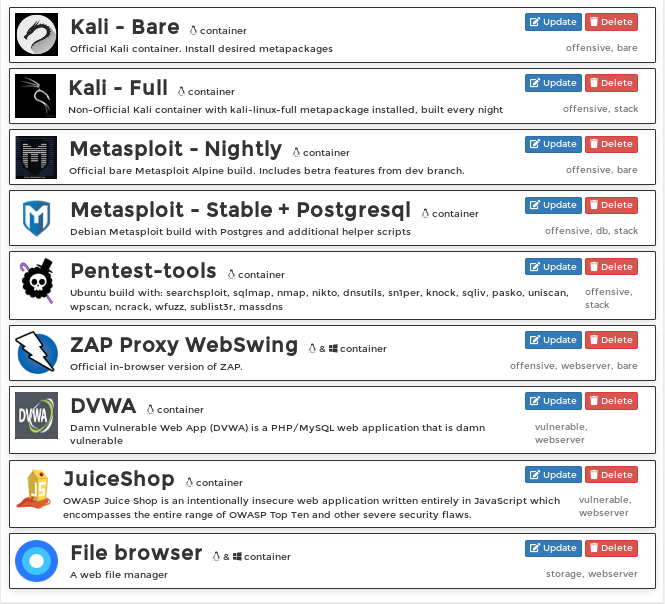

:anchor: Offensive Security Lab
===


## TOC

- [Offensive Security Lab](#offensive-security-lab)
  - [Demo](#demo)
    - [Deploying](#deploying)
    - [Attacking](#attacking)
    - [Full list](#full-list)
- [Presentation](#presentation)
- [Table of content](#table-of-content)
- [Getting started](#getting-started)
  - [Pre-requisits](#pre-requisits)
  - [Quick start](#quick-start)
    - [Deploy](#deploy)
    - [Access](#access)
    - [Launch as daemon](#launch-as-daemon)
  - [Manual Start](#manual-start)
    - [Deploy](#deploy)
    - [Test the first run](#test-the-first-run)
    - [Launch as daemon](#launch-as-daemon)
  - [Cleaning](#cleaning)
- [Templates](#templates)
  - [Kali-Bare](#kali-bare)
  - [Kali-Full](#kali-full)
  - [Metasploit-Nightly](#metasploit-nightly)
  - [Metasploit-Postgresql](#metasploit-postgresql)
  - [Pentest-tools](#pentest-tools)
  - [ZAP Proxy WebSwing](#zap-proxy-webswing)
  - [DVWA-Damn Vulnerable Web App](#dvwa-damn-vulnerable-web-app)
  - [OWASP JuiceShop-Vulnerable HTML5/JS App](#owasp-juiceshop-vulnerable-html5js-app)
- [License & Demo](#license--demo)
  - [Lab Licence](#lab-licence)
  - [Image Credit](#image-credit)


## Demo

### Deploying

*Deploying a Metasploit Dev build and OWASP JuiceShop in less than 10 seconds* :zap:




### Attacking

*Deploying the pentest-toolbox and scanning the OWASP JuiceShop container using container subnet. This allows for very fast interactions compared to a classic offensive scenario* :rocket:




### Full list



---

# Presentation

This lab is built using [Portainer](https://portainer.io) and custom made `App Templates`. The following are currently implemented:  
  

|                Name               	| Description                                                                                                                                                                      	|     Status     	|
|:---------------------------------:	|----------------------------------------------------------------------------------------------------------------------------------------------------------------------------------	|:--------------:	|
|            **Kali** - Bare            	| Official Kali container. Install desired metapackages                                                                                                                            	|      :ok:      	|
|            **Kali** - Full            	| Non-Official Kali container with kali-linux-full metapackage installed, built every night                                                                                        	|      :ok:      	|
|        **Metasploit** - Nightly       	| Official bare Metasploit Alpine build. Includes beta features from dev branch                                                                                                   	|      :ok:      	|
| **Metasploit** - Stable + Postsgresql 	| Debian Metasploit build with Postgres and additional helper scripts                                                                                                              	|     :ok:           	|
|           **Pentest-tools**           	| Ubuntu build with: searchsploit, sqlmap, nmap, nikto, dnsutils, sn1per, knock, sqliv, pasko, uniscan, wpscan, ncrack, wfuzz, sublist3r, massdns                                  	|      :ok:      	|
|         **ZAP Proxy** WebSwing        	| Official in-browser version of ZAP                                                                                                                                               	|      :ok:      	|
|                **DVWA**               	| Damn Vulnerable Web App (DVWA) is a PHP/MySQL web application that is damn vulnerable                                                                                            	|      :ok:      	|
|             **JuiceShop**             	| OWASP Juice Shop is an intentionally insecure web application written entirely in JavaScript which encompasses the entire range of OWASP Top Ten and other severe security flaws 	|      :ok:      	|
| **FileBrowser**                       	| A web file manager                                                                                                                                                               	| :construction: 	|


---

# Table of content

- [AKKA Offensive Security Lab](#akka-offensive-security-lab)
- [License & Demo](#license--demo)
  - [Lab Licence](#lab-licence)
  - [Image Credit](#image-credit)
  - [Demo](#demo)
    - [Deploying](#deploying)
    - [Attacking](#attacking)
    - [Full list](#full-list)
- [Presentation](#presentation)
- [Table of content](#table-of-content)
- [Getting started](#getting-started)
  - [Pre-requisits](#pre-requisits)
  - [Quick start](#quick-start)
    - [Deploy](#deploy)
    - [Access](#access)
    - [Launch as daemon](#launch-as-daemon)
  - [Manual Start](#manual-start)
    - [Deploy](#deploy)
    - [Test the first run](#test-the-first-run)
    - [Launch as daemon](#launch-as-daemon)
  - [Cleaning](#cleaning)
- [Templates](#templates)
  - [Kali-Bare](#kali-bare)
  - [Kali-Full](#kali-full)
  - [Metasploit-Nightly](#metasploit-nightly)
  - [Metasploit-Postgresql](#metasploit-postgresql)
  - [Pentest-tools](#pentest-tools)
  - [ZAP Proxy WebSwing](#zap-proxy-webswing)
  - [DVWA-Damn Vulnerable Web App](#dvwa-damn-vulnerable-web-app)
  - [OWASP JuiceShop-Vulnerable HTML5/JS App](#owasp-juiceshop-vulnerable-html5js-app)

# Getting started

## Pre-requisits

This lab uses Portainer to orchestrate the deployment of the various components presented above. To run the Portainer lab you will need `git`, `docker` and `docker-compose`.  

Optionally, you can run the Lab using a `docker-machine` configuration to your favorite cloud provider to make it even easier.


## Quick start

### Deploy

```bash

> git clone git@gitlab.com:akka-infosec/ceh-portainer.git
> cd ceh-portainer
> docker-compose up

```

Once `docker-compose` has correctly started, direct you web browser to `http://127.0.0.1/portainer`, replacing the IP with Docker's.

* Set password
* Select the single endpoint presented by the interface
* Head over to `App Templates`. From there, choose and deploy what you wish

### Access

Refer to the Templates documentation below for the **web server ports**, or **attach** your CLI to the target container using docker

```bash
> docker attach <container-name>
``` 

###  Launch as daemon

*Note this also supresses error messages from the docker-compose engine to stdout*

```bash
> ^C
> docker-compose down # if from another tty
> docker-compose up -d
```

## Manual Start

### Deploy

First pull the official Portainer dedicated `docker-compose` repository

```bash
> git clone https://github.com/portainer/portainer-compose.git
``` 

Modify the `docker-compose.yml` file to point to the custom App Template. 

```bash
> cd ceh-portainer
> nano docker-compose.yml
```

Replace 

```
command: --templates http://templates/templates.json
```

by 

```
command: --templates https://raw.githubusercontent.com/khast3x/portainer-pentest-lab/master/templates.yml --host=unix:///var/run/docker.sock
```

In some instances, the `watchtower` module that is summoned by the docker-compose file can cause some problems. You can safely remove it.

You can check that your modifications did not break the configuration file by using a [YAML checking tool](http://www.yamllint.com/).

###  Test the first run

```bash
> cd ceh-portainer
> docker-compose up

# Make sure everything works by viewing the stdout debug output, then stop the stack

> ^C
```

###  Launch as daemon

```bash
> docker-compose up -d
```

## Cleaning

To remove all portainer local data, docker images, containers, volumes and networks:  

```bash
> docker system prune  ; rm -rf /opt/portainer/
```

# Templates

*Default values such as ports or volumes can be changed by selecting __(+) Advanced Settings__ on the container page before deploying*

<!-- |                 	|   	|
|-----------------	|---	|
| Container Name: 	|   	|
| Source:         	|   	|
| Ports:          	|   	|
| Image:          	|   	|
| Usage:          	|   	| -->

## Kali-Bare


|                 	|   	|
|-----------------	|---	|
| Container Name: 	| kali-bare  	|
| Source:         	|  [Link](https://hub.docker.com/r/kalilinux/kali-linux-docker/) 	|
| Ports:          	|  4444:4444 	|
| Image:          	|  kalilinux/kali-linux-docker 	|
| Usage:          	| This image comes bare and requires installing your desired kali [metapackages](https://www.kali.org/news/kali-linux-metapackages/). Once deployed, you can access it through the CLI by typing `docker attach kali-bare`


## Kali-Full

|                 	|   	|
|-----------------	|---	|
| Container Name: 	|  kali-full 	|
| Source:         	|  [Link](https://hub.docker.com/r/booyaabes/kali-linux-full/) 	|
| Ports:          	|  4445:4444 	|
| Image:          	|  booyaabes/kali-linux-full 	|
| Usage:          	|  Kali image with kali-linux-full metapackage installed, built every night. Once deployed, you can access it through the CLI by typing `docker attach kali-full`  	|


## Metasploit-Nightly

|                 	|   	|
|-----------------	|---	|
| Container Name: 	|  msf-dev 	|
| Source:         	|  [Link](https://hub.docker.com/r/metasploitframework/metasploit-framework/) 	|
| Ports:          	|  4446:4444 	|
| Image:          	|   metasploitframework/metasploit-framework	|
| Usage:          	|  Official bare Metasploit Alpine build. Includes beta features from the dev branch. Once deployed, you can access it through the CLI by typing `docker attach kali-full`. From the bash prompt you can start `./msfconsole` or `./msfvenom` 	|

## Metasploit-Postgresql

|                 	|   	|
|-----------------	|---	|
| Container Name: 	|  msf-postgresql 	|
| Source:         	|  [Link](https://hub.docker.com/r/phocean/msf/) 	|
| Ports:          	|  4447:4444 	|
| Image:          	|   phocean/msf	|
| Usage:          	|  Non official Metasploit build on Debian. Comes with pre-configured `msfdb`. Remember to start it inside the container by using `service postgresql start`. Metasploit will recognize it automatically. Once deployed, you can access it through the CLI by typing `docker attach kali-full`. From the bash prompt you can start `./msfconsole` or `./msfvenom`. From the msfconsole, you can check the database status with `db_status` 	|


## Pentest-tools


|                 	|   	|
|-----------------	|---	|
| Container Name: 	|  pentest-tools 	|
| Source:         	|  [Link](https://hub.docker.com/r/szalek/pentest-tools/) 	|
| Ports:          	|   	|
| Image:          	|  szalek/pentest-tools 	|
| Usage:          	|  Ubuntu build with: searchsploit, sqlmap, nmap, nikto, dnsutils, sn1per, knock, sqliv, pasko, uniscan, wpscan, ncrack, wfuzz, sublist3r, massdns. Once deployed, you can access it through the CLI by typing `docker attach pentest-tools`. All the scripts are already in the shell binary path 	|


## ZAP Proxy WebSwing

|                 	|   	|
|-----------------	|---	|
| Container Name: 	|  zap-proxy 	|
| Source:         	| [Link](https://hub.docker.com/r/owasp/zap2docker-stable/)  	|
| Ports:          	|  8081:8080, 8090:8090 	|
| Image:          	|  owasp/zap2docker-stable 	|
| Usage:          	|  Official in-browser version of OWASP ZAP. Once deployed, head over to `http://127.0.0.1:8081/?anonym=true&app=ZAP` with the appropriate IP address. This is important, otherwise you won't have access to the app 	|


## DVWA-Damn Vulnerable Web App

|                 	|   	|
|-----------------	|---	|
| Container Name: 	| vuln-dvwa  	|
| Source:         	|  [Link](https://hub.docker.com/r/vulnerables/web-dvwa/) 	|
| Ports:          	|  8082:80 	|
| Image:          	| vulnerables/web-dvwa 	|
| Usage:          	| Point your browser to `http://127.0.0.1:8082` to access it. To start using:  Generate DB from the web interface, Login using `admin/password`. Select DVWA Security in the left menu, set your difficulty level  	|

## OWASP JuiceShop-Vulnerable HTML5/JS App

|                 	|   	|
|-----------------	|---	|
| Container Name: 	| vuln-juiceshop  	|
| Source:         	|  [Link](https://hub.docker.com/r/bkimminich/juice-shop/) 	|
| Ports:          	|  8084:3000 	|
| Image:          	|  bkimminich/juice-shop 	|
| Usage:          	|  Point your browser to `http://127.0.0.1:8084`	to access it|


# License & Demo

## Lab Licence
 
Copyright [2018] [TMC - AKKA]

Licensed under the Apache License, Version 2.0 (the "License");
you may not use this file except in compliance with the License.
You may obtain a copy of the License at

  http://www.apache.org/licenses/LICENSE-2.0

Unless required by applicable law or agreed to in writing, software
distributed under the License is distributed on an "AS IS" BASIS,
WITHOUT WARRANTIES OR CONDITIONS OF ANY KIND, either express or implied.
See the License for the specific language governing permissions and
limitations under the License.

## Image Credit

Icon made by Freepik from www.flaticon.com
